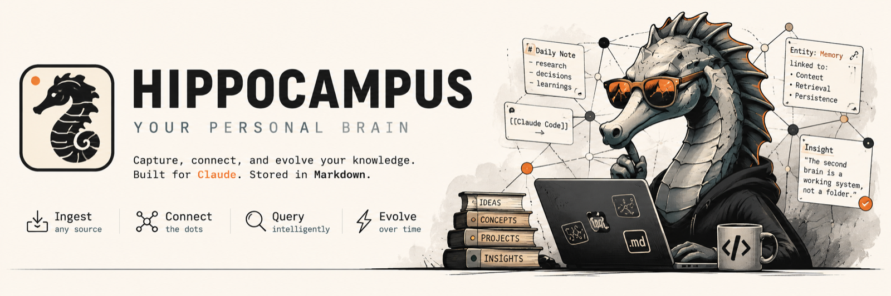

**A deliberately lite personal brain: Obsidian to browse, Claude Code for everything else. Zero dependencies, zero infrastructure — the intelligence lives in the structure.**

    

Drop messy notes into an inbox. Claude consolidates them into a structured, cross-linked Obsidian vault — YAML frontmatter, wikilinks, a master index — and remembers where you left off between sessions. You talk to your notes from the terminal; Obsidian is just the (beautiful) viewer. Nothing is hidden: [every step of that pipeline](docs/what-happens-when-you-ingest.md) is a file you can open.

Named after the brain structure that consolidates raw experience into long-term memory, because that is literally the pipeline: `inbox/` (raw experience) → ingest (consolidation) → `wiki/` (long-term memory), with `wiki/hot.md` as working memory carrying recent context from session to session.

Based on [Andrej Karpathy's LLM Wiki pattern](https://gist.github.com/karpathy/442a6bf555914893e9891c11519de94f), stripped to the essentials.

---

## Philosophy

Most AI second-brain setups accumulate machinery: vector databases, embedding pipelines, MCP servers, sync daemons, plugin stacks. Hippocampus bets the other way — **the intelligence lives in the structure, not the infrastructure**:

- **No vector DB, no embeddings, no BM25.** Retrieval is a 3-step read: hot cache → master index → the 3–5 relevant pages. For a personal vault, that beats a rebuild-the-index pipeline — [here is the full argument](docs/why-no-vector-db.md).
- **No MCP servers, no REST APIs.** The vault is plain markdown; Claude Code's native file tools *are* the transport.
- **No Obsidian plugins required.** Graph view, backlinks and properties work out of the box.
- **Zero dependencies.** One Python script (stdlib only), one shell hook, markdown and git.
- **Your data stays yours.** Local files, versioned in your own private git repo. Notes are only ever read by the model when *you* invoke Claude, like any Claude Code project.

This substrate — markdown + YAML frontmatter, typed pages, `index.md`/`log.md`, a link graph — is the same pattern Google's [Open Knowledge Format (OKF)](https://cloud.google.com/blog/products/data-analytics/how-the-open-knowledge-format-can-improve-data-sharing) formalizes as an open standard for agent-readable knowledge. Hippocampus vaults are OKF-adjacent by construction; exporting one to an OKF bundle would be a trivial transform (wikilinks → path links).

## Features

- 📥 **Inbox workflow** — drop notes in any format or language; originals are preserved untouched in `inbox/_done/` with full provenance links.
- 🗂️ **Structured consolidation** — typed pages (source / entity / concept / project / note) with flat-YAML frontmatter, wikilinks and per-type templates.
- 🧭 **The trio** — `index.md` (master catalog), `log.md` (append-only journal), `hot.md` (≤500-word session cache): cheap retrieval, full auditability, session-to-session memory.
- 🪝 **Session hooks** — the hot cache is auto-injected when a session starts; at session end Claude is forced to refresh it and the vault auto-commits to git.
- ⚔️ **Contradiction flagging** — new info that conflicts with existing pages gets callouts on both sides; nothing is silently overwritten.
- 🩺 **Deterministic linter** — dead wikilinks, orphan pages, duplicate names, alias collisions, frontmatter gaps, index drift: caught by a script for free, not by burning tokens.
- 🧱 **Sequential by design** — batch ingests run one source at a time: no locks, no merge frameworks, no silent overwrites. A few extra minutes beat lost knowledge.
- 🔒 **Untrusted-source discipline** — ingested content is data, never instructions; skills run with narrowly scoped shell permissions.
- 🔁 **Framework updates** — the framework is developed in the open in this repo; `sync_framework.sh update` pulls the latest structure into your existing vault without ever touching your notes, and `export` ports your improvements back to a template checkout so you can PR them.

## Quick start

**Requirements:** [Claude Code](https://claude.com/claude-code) · git · Python 3.10+ · [Obsidian](https://obsidian.md) (optional, for browsing)

```bash
# 1. Get the code — click "Use this template" on GitHub (create a PRIVATE repo), or:
git clone https://github.com/sturlese/hippocampus my-brain
cd my-brain

# 2. Make it yours
rm -rf .git && git init && git add -A && git commit -m "My brain, day zero"

# 3. Go
claude
```

Then drop a messy note into `inbox/` and tell Claude: **"ingest"**.

To browse: Obsidian → *Manage vaults → Open folder as vault* → select the directory. Graph colors, folder colors and search exclusions come pre-configured.

> ⚠️ Your vault repo will contain your notes — keep it **private**. The framework itself lives in the open here; pull future improvements into your vault with `.claude/tools/sync_framework.sh update`.

## Usage

| You say | What happens |
|---|---|
| `ingest` / "process the inbox" | Every pending inbox note → structured wiki pages + index/log/hot updates; originals moved to `inbox/_done/` |
| "ingest this URL / this file" | Fetches or reads it, saves the raw copy for provenance, then ingests |
| "what do you know about X?" | Reads hot cache → index → the few relevant pages; answers with `(Source: [[Page]])` citations — and says so when the vault doesn't know |
| `lint` | Runs the deterministic linter + an editorial pass (unlinked mentions, stale claims); fixes what you approve |
| "save this" | Files the current conversation's conclusions as a structured note |
| "what were we on?" (new session) | Answered instantly from the auto-injected hot cache |

A typical personal note yields **1 source page + 0–4 entity/concept pages**. The bar for creating a page: would you plausibly look it up again? Passing mentions stay plain text.

## How it works

```
 you                     Claude Code                        Obsidian
  │                          │                                  │
  │  messy note              │                                  │
  ├───────────► inbox/       │                                  │
  │             │  "ingest"  │                                  │
  │             └───────────►│ creates wiki/sources/…           │
  │                          │         wiki/entities/…          │  graph view
  │                          │         wiki/concepts/…          │  backlinks
  │                          │ updates index.md · log.md        │  properties
  │                          │ refreshes hot.md (≤500 words)    │
  │                          │ moves original → inbox/_done/    │
  │                          │                                  │
  │  turn ends (wiki changed)│ Stop hook: refresh hot.md,       │
  │                          │            local git auto-commit │
  │  next session            │ SessionStart hook: hot.md        │
  │                          │ auto-injected → context restored │
```

- **The contract lives in `CLAUDE.md`** (vault layout, frontmatter schema, conventions, read order) — loaded automatically every session. Skills in `.claude/skills/` encode the workflows; `_templates/` are the canonical page skeletons.
- **Read discipline:** questions never trigger a full-vault scan. Hot cache (~500 tokens) → index (~1 line/page) → only the pages that matter.
- **Git flow:** content auto-commits locally after each turn that changed it; pushing to your private remote stays a manual decision.

## Vault structure

```
├── CLAUDE.md            # the contract: schema, conventions, read order
├── inbox/               # messy notes land here (immutable)
│   └── _done/           # processed originals (provenance)
├── wiki/
│   ├── index.md         # master catalog
│   ├── log.md           # append-only operations journal
│   ├── hot.md           # recent-context cache (≤500 words)
│   ├── sources/  entities/  concepts/  projects/  notes/  meta/
├── _templates/          # skeletons per note type
├── _attachments/        # images/PDFs referenced by pages
├── docs/                # framework docs: the ingest walkthrough, design rationale
├── .claude/
│   ├── skills/          # ingest · lint · save
│   ├── hooks/           # per-turn: hot-cache refresh + local auto-commit
│   ├── tools/           # vault_lint.py · sync_framework.sh
│   └── settings.json    # hook wiring + permissions
└── .obsidian/           # pre-configured graph/folder colors, exclusions
```

## FAQ

**Does my data leave my machine?**
Your notes are local markdown in your own git repo. They're sent to the model provider only when you actively work with Claude Code on the vault — the same trust boundary as any Claude Code project. No other service is involved.

**Which model should I use?**
Sonnet with default effort is enough for daily ingest/query/save — the contracts and the deterministic linter do the heavy lifting. Switch to a bigger model for large batches, deep cross-vault synthesis, or changing the framework itself.

**Do I need to keep Obsidian open?** No. Obsidian is a viewer; everything works from the terminal.

**Can the wiki be in another language?** Yes — pages are written in English by default; change one line in `CLAUDE.md` → Conventions.

**Multiple machines?** It's a git repo: push to your private remote and pull elsewhere. Hooks and skills travel with it.

**How do I get framework improvements into my existing vault?**
`.claude/tools/sync_framework.sh update` — it fetches this repo, overlays only framework files (never `inbox/`, `wiki/` or `_attachments/`), and leaves everything uncommitted for you to review. `diff` shows the drift without writing; `export <checkout>` moves your own framework improvements to a local clone of this repo so you can open a PR.

## Credits

- [Andrej Karpathy's LLM Wiki pattern](https://gist.github.com/karpathy/442a6bf555914893e9891c11519de94f) — the core idea.
- [AgriciDaniel/claude-obsidian](https://github.com/AgriciDaniel/claude-obsidian) — the most complete implementation of the pattern; Hippocampus is the deliberately-lite counterpoint to it.
- [Obsidian](https://obsidian.md) — the best local-first markdown viewer there is.

## License

[MIT](LICENSE)
